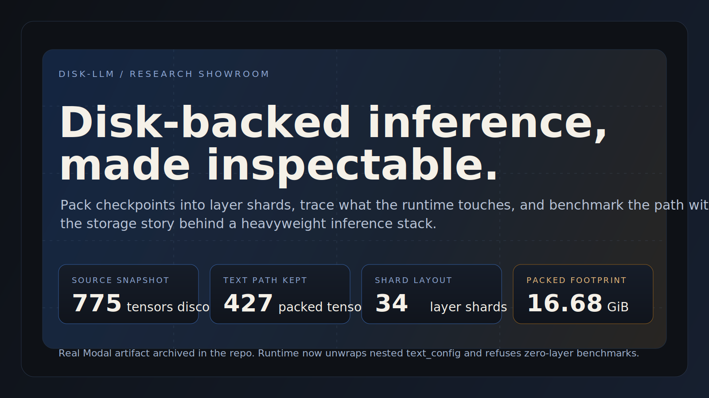
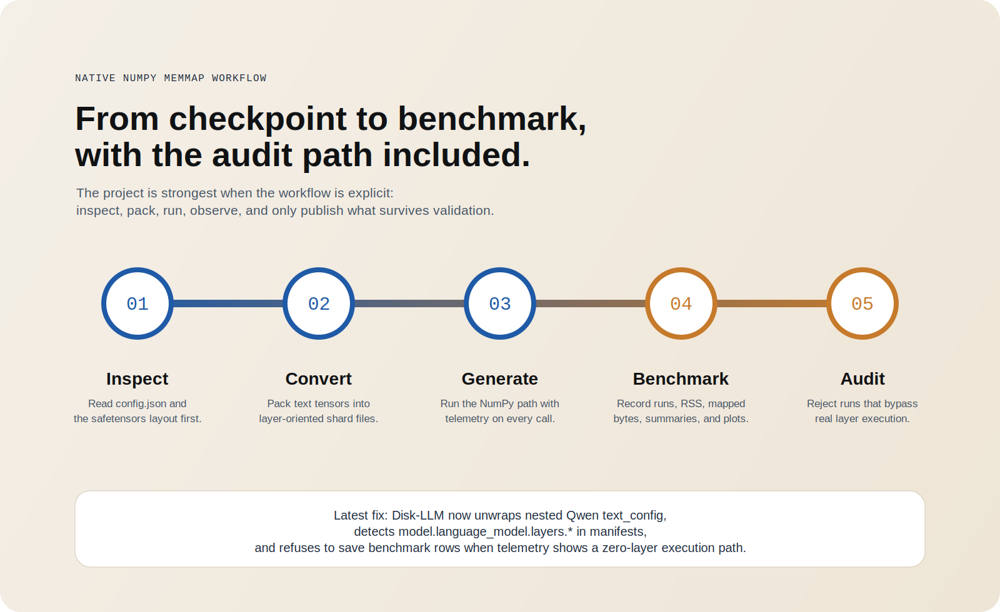
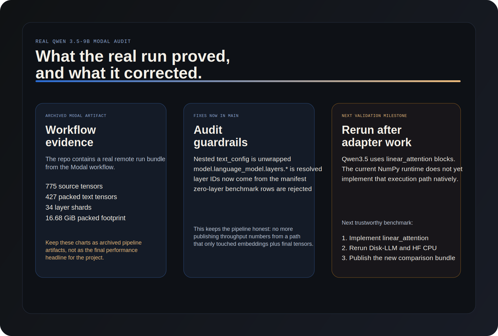
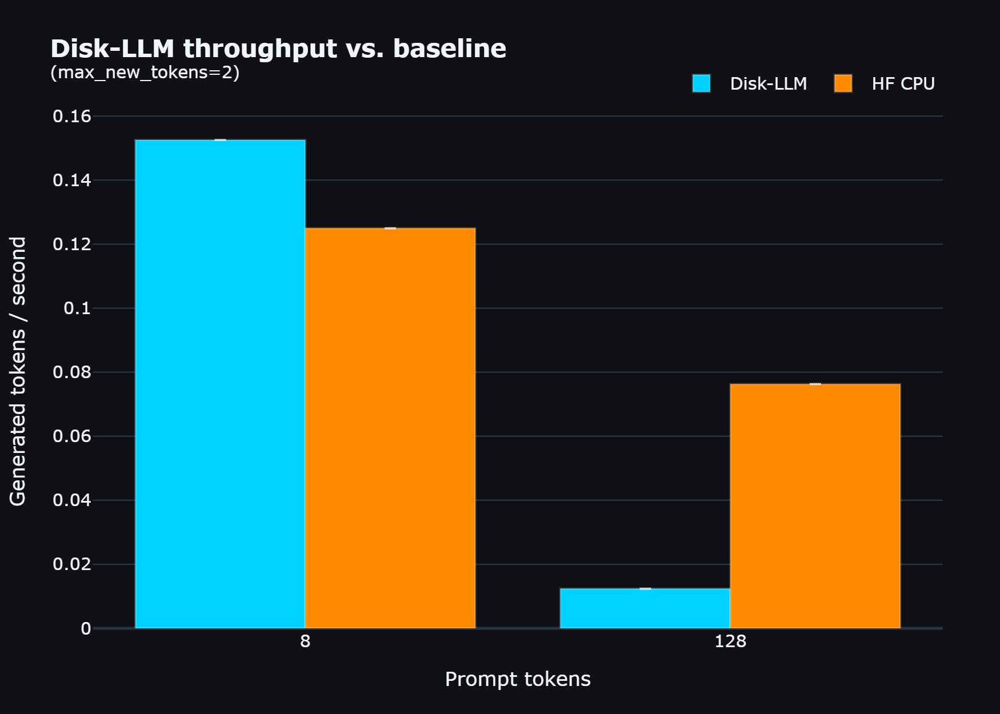
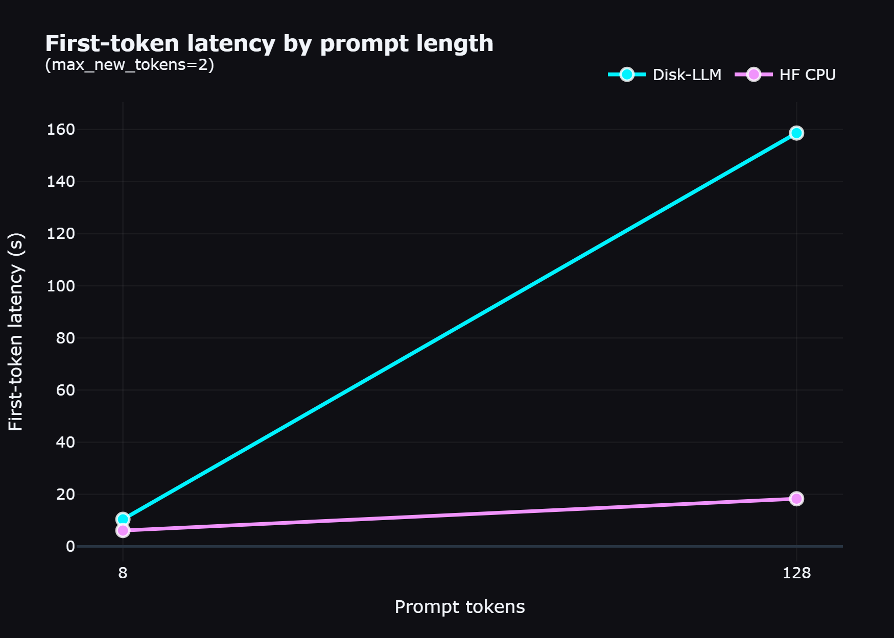
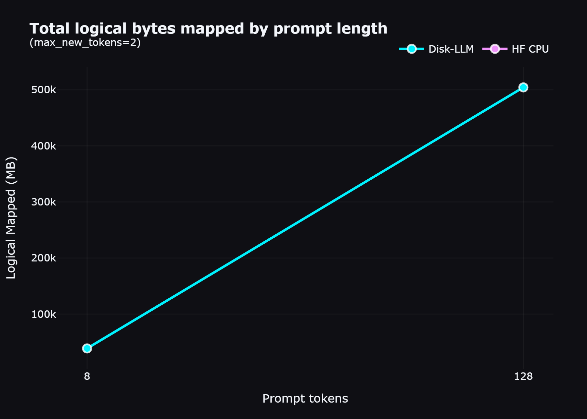
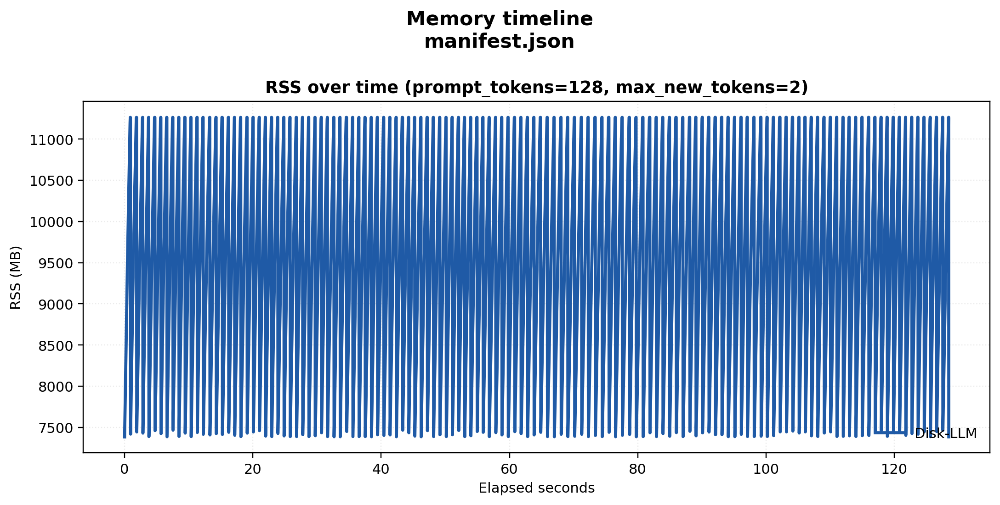

<p align="center">
  
</p>

<p align="center">
  
</p>

# Disk-LLM

Disk-LLM is an inspectable disk-backed LLM research kit.

The project is built around a simple idea: if we are going to stream model weights from disk, we should make that path explicit, measurable, and understandable. Instead of treating checkpoint files as the final runtime layout, Disk-LLM repacks text weights into layer-oriented memmap shards and exposes runtime telemetry so the storage story stays visible.

The goal is not to beat mature inference engines like `llama.cpp`, `vLLM`, or `SGLang` on production throughput. The goal is narrower and more research-friendly:

- convert checkpoints into a layout the OS can page predictably
- run a native NumPy memmap path on CPU
- inspect what was packed, what was skipped, and what the runtime actually touched
- benchmark that path with reproducible CSVs, plots, and remote Modal runs

The project website is published at [kilickursat.github.io/disk-llm](https://kilickursat.github.io/disk-llm/).

## Why Disk-LLM Exists

Disk offload is not new. What is different here is the emphasis on inspectability.

- **Engineered layer sharding:** weights are packed into architecture-aligned shard files instead of left in monolithic checkpoint blobs.
- **Glass-box telemetry:** the runtime reports logical bytes mapped, tensors touched, first-token latency, generated token counts, and per-layer timings.
- **Research-first workflow:** inspect, convert, benchmark, plot, and audit are all first-class parts of the repo.

<p align="center">
  
</p>

## Current Status

- `convert`: implemented
- `inspect`: implemented
- `generate`: implemented
- `bench`: implemented with repeatable CSV + plot export
- `demo`: implemented as an optional Gradio wrapper
- Qwen 3.5 runtime: still experimental

The important change in the current branch is that the Qwen audit path is now stricter and more honest:

- nested `text_config` is now unwrapped correctly
- `model.language_model.layers.*` is now detected in manifests and inspections
- benchmark runs now refuse to save misleading zero-layer telemetry results

That means the project is better positioned for a trustworthy rerun than it was when the first Modal artifact bundle was committed.

<p align="center">
  
</p>

## Real Qwen Modal Audit

The repo includes a real Modal artifact bundle in [`modal-results`](modal-results). It proves that the remote workflow ran against `Qwen/Qwen3.5-9B` and produced a full inspection / conversion / plotting bundle.

Verified facts from that archived artifact:

- source tensors discovered: `775`
- packed text tensors: `427`
- skipped tensors: `348`
- packed shards: `34`
- packed footprint: `16.68 GiB`
- source architecture: `Qwen3_5ForConditionalGeneration`

What the audit uncovered:

- the real checkpoint is wrapped by a multimodal top-level config with nested `text_config`
- the original benchmark artifact was generated before the runtime correctly enforced full layer execution
- the NumPy runtime still needs a native `linear_attention` adapter before Qwen 3.5 benchmark claims should be treated as final

So the archived Modal plots below should be read as **pipeline evidence**, not as the final benchmark headline.

<table>
  <tr>
    <td></td>
    <td></td>
  </tr>
  <tr>
    <td></td>
    <td></td>
  </tr>
</table>

## Quick Start

### 1. Install

```bash
pip install -e .
```

Optional extras:

```bash
pip install -e .[hf,demo,test,bench]
```

For Hugging Face parity or CPU-baseline benchmarks, make sure a CPU PyTorch build is available in the environment.

### 2. Inspect a source snapshot

```bash
disk-llm inspect --source-dir /path/to/Qwen3.5-9B
```

### 3. Convert it into Disk-LLM layout

```bash
disk-llm convert /path/to/Qwen3.5-9B ./packed-qwen35
```

### 4. Inspect the packed manifest

```bash
disk-llm inspect --manifest ./packed-qwen35/manifest.json
```

### 5. Generate from the packed model

```bash
disk-llm generate ./packed-qwen35/manifest.json --prompt "Explain disk-backed inference in one paragraph."
```

### 6. Run repeated benchmark cases

```bash
python scripts/benchmark.py ./packed-qwen35/manifest.json \
  --prompt "Explain disk-backed inference in one paragraph." \
  --tokenizer /path/to/Qwen3.5-9B \
  --backends disk_llm,hf_cpu \
  --hf-model /path/to/Qwen3.5-9B \
  --prompt-lengths 8,64,256,512 \
  --max-new-tokens 16 \
  --runs 3 \
  --output-dir ./benchmark-results/qwen35-cpu
```

Outputs:

- `benchmark_runs.csv`
- `benchmark_summary.csv`
- `memory_timeline.csv`
- `benchmark_metadata.json`

### 7. Generate plots

```bash
python scripts/plot_results.py ./benchmark-results/qwen35-cpu
```

### 8. Keep the model off your local machine

If you want to run the full workflow remotely on Modal, use the runbook in [`docs/modal_remote_run.md`](docs/modal_remote_run.md).

Helper wrappers:

- `scripts/run_modal_qwen35_9b.sh`
- `scripts/run_modal_qwen35_9b.ps1`

## What Gets Packed

The default v1 converter targets the text-only path:

- `model.embed_tokens.*`
- `model.layers.<n>.*`
- `model.language_model.layers.<n>.*`
- `model.norm.*`
- `model.language_model.norm.*`
- `lm_head.*`

Known multimodal tensors such as `visual.*` are skipped and recorded in the manifest.

Weights are copied into layer-oriented shards:

- `embeddings/embeddings.bin`
- `layers/layer_000.bin`
- `layers/layer_001.bin`
- `...`
- `final/final.bin`

Each tensor receives a manifest entry with:

- shard path
- byte offset
- byte length
- source file
- dtype
- shape
- tensor checksum

## Telemetry

Every runtime call can emit:

- logical bytes mapped
- tensors touched
- per-layer wall time
- first-token latency
- generated token count
- tokens per second

The benchmark scripts extend that with repeated-run CSVs, RSS sampling via `psutil`, Markdown summaries, and plot generation.

## Roadmap

- implement a native Qwen 3.5 `linear_attention` runtime path
- rerun the real `Qwen/Qwen3.5-9B` Modal comparison with Disk-LLM and HF CPU side by side
- add correctness checks beyond throughput and RSS
- deepen telemetry with cache and disk-fault oriented instrumentation
- expand the adapter story for additional model families

## Development

Run the stdlib test suite:

```bash
python -m unittest discover -v
```

The repo is designed to stay importable even when optional dependencies are missing, which makes it easier to inspect the converter, manifest flow, and CLI without first downloading a full inference stack.

## Contributing

Please read [CONTRIBUTING.md](CONTRIBUTING.md) before opening a pull request.

High-value contributions include:

- new tensor-name adapters
- runtime correctness tests against reference implementations
- benchmark datasets and published result bundles
- better inspection for hybrid block layouts
- tokenizer and chat-template integration improvements
