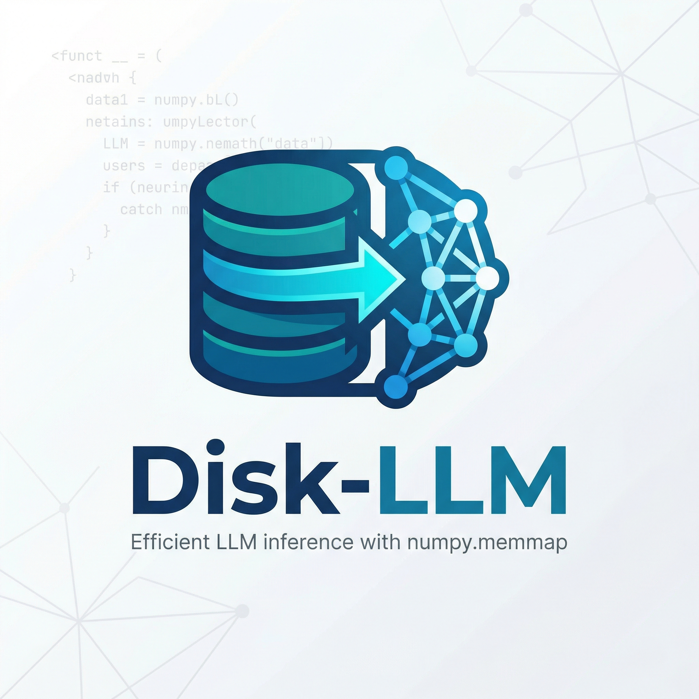
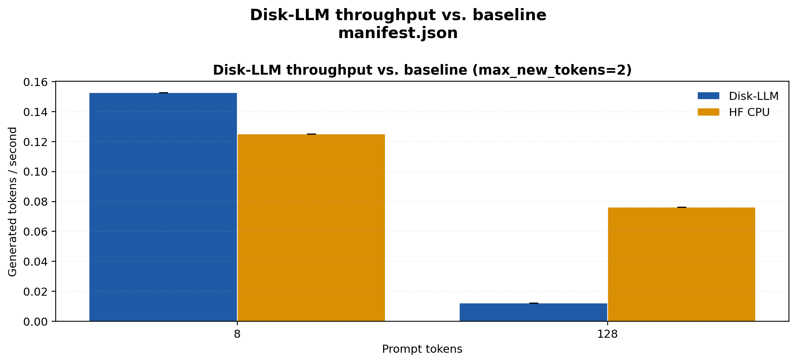
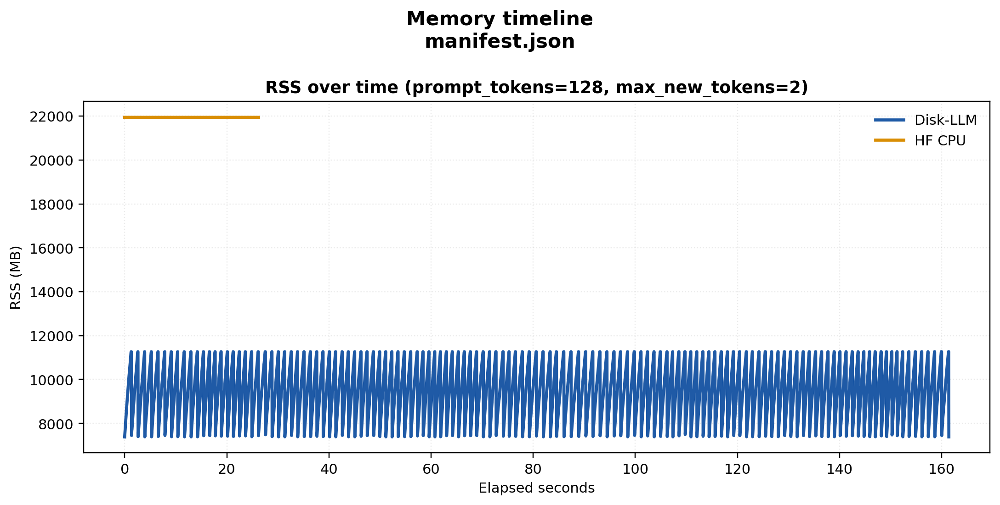
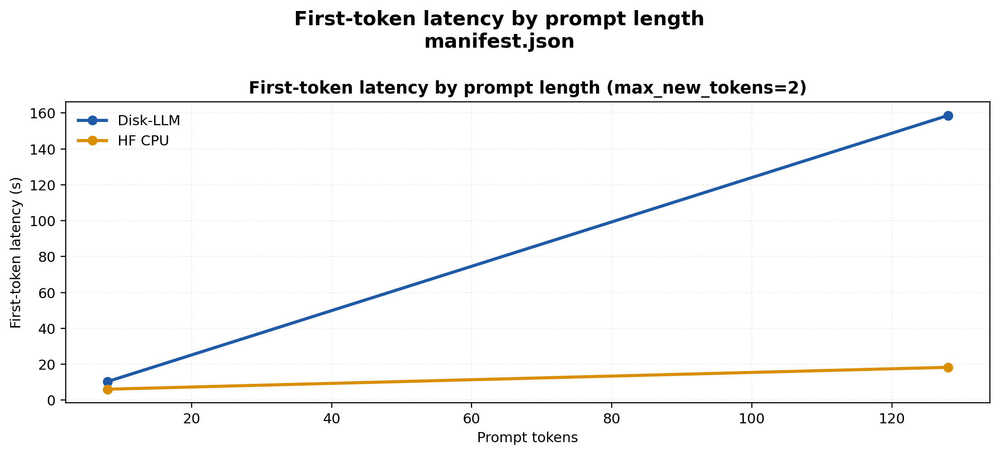

<p align="center">
  
</p>

# Disk-LLM

Disk-LLM is an inspectable disk-backed LLM research kit. The project is built around two ideas:

1. pack weights into layer-oriented memmap shards instead of treating raw checkpoints as the final runtime layout
2. make the runtime observable, so you can see which tensors are mapped, how long each layer took, and what the generation loop is doing

This repository is intentionally opinionated. It is not trying to beat mature inference engines like `llama.cpp`, `vLLM`, or `SGLang` on production throughput. The v1 goal is narrower and more tangible:

Run short text-only generations from a disk-packed model layout on CPU while exposing live telemetry for researchers and contributors.

A branded project website is published at [kilickursat.github.io/disk-llm](https://kilickursat.github.io/disk-llm/), and the local demo UI now uses the project logo directly.

## Current status

- `convert`: implemented
- `inspect`: implemented
- `bench`: implemented, with reproducible CSV/plot scripts for repeated experiments
- `generate`: implemented
- `demo`: implemented as an optional Gradio wrapper
- Qwen 3.5 text runtime: experimental adapter scaffold

The converter and manifest flow are solid enough to start experimenting today. The NumPy runtime is intentionally marked experimental because Qwen 3.5 uses a newer hybrid architecture and exact tensor-name coverage should be validated against a real checkpoint snapshot.

## Why this project exists

The original project idea focused on `numpy.memmap`, but `safetensors` already gives you zero-copy and lazy-loading benefits. Disk-LLM becomes interesting when it adds something new:

- layer-packed disk layout
- model inspection before conversion
- text-only subgraph filtering for multimodal checkpoints
- runtime telemetry
- a compact codebase that contributors can actually read

## Project structure

```text
disk-llm/
├─ src/disk_llm/
│  ├─ cli.py
│  ├─ converter.py
│  ├─ inspect.py
│  ├─ layout.py
│  ├─ manifest.py
│  ├─ optional.py
│  ├─ safetensors_io.py
│  └─ runtime/
│     ├─ config.py
│     ├─ kernels.py
│     ├─ memmap.py
│     ├─ model.py
│     └─ telemetry.py
├─ docs/
│  ├─ architecture.md
│  ├─ documentation.html
│  ├─ converter.html
│  ├─ index.html
│  └─ telemetry.html
├─ tests/
└─ pyproject.toml
```

## Quick start

### 1. Install

```bash
pip install -e .
```

Optional extras:

```bash
pip install -e .[hf,demo,test,bench]
```

For Hugging Face parity or CPU-baseline benchmarks, make sure a CPU PyTorch build is also available in the environment.

### 2. Inspect a Hugging Face snapshot

```bash
disk-llm inspect --source-dir /path/to/Qwen3.5-9B
```

### 3. Convert it into Disk-LLM layout

```bash
disk-llm convert /path/to/Qwen3.5-9B ./packed-qwen35
```

### 4. Inspect the packed manifest

```bash
disk-llm inspect --manifest ./packed-qwen35/manifest.json
```

### 5. Generate with token ids

```bash
disk-llm generate ./packed-qwen35/manifest.json --prompt-ids 1,2,3 --max-new-tokens 8 --show-telemetry
```

### 6. Generate with text

If the source snapshot contains tokenizer files and `transformers` is installed:

```bash
disk-llm generate ./packed-qwen35/manifest.json --prompt "Explain disk-backed inference in one paragraph."
```

### 7. Launch the demo UI

```bash
disk-llm demo ./packed-qwen35/manifest.json --tokenizer /path/to/Qwen3.5-9B
```

### 8. Run repeated benchmark cases

Save repeated runs, prompt-length sweeps, and process-memory timelines:

```bash
python scripts/benchmark.py ./packed-qwen35/manifest.json \
  --prompt "Explain disk-backed inference in one paragraph." \
  --tokenizer /path/to/Qwen3.5-9B \
  --backends disk_llm,hf_cpu \
  --hf-model /path/to/Qwen3.5-9B \
  --prompt-lengths 8,64,256,512 \
  --max-new-tokens 16 \
  --runs 3 \
  --output-dir ./benchmark-results/qwen35-cpu
```

This writes:

- `benchmark_runs.csv`
- `benchmark_summary.csv`
- `memory_timeline.csv`
- `benchmark_metadata.json`

### 9. Generate comparison plots

```bash
python scripts/plot_results.py ./benchmark-results/qwen35-cpu
```

The plot step produces:

- throughput bar charts
- first-token latency curves
- RSS timeline plots
- a Markdown comparison table for reports or README updates

### 10. Run the full workflow on Modal

If you want to keep the Qwen snapshot off your local machine, use the remote runner and saved command sequence in [`docs/modal_remote_run.md`](docs/modal_remote_run.md). The helper wrappers are:

- `scripts/run_modal_qwen35_9b.sh`
- `scripts/run_modal_qwen35_9b.ps1`

## Qwen3.5-9B Modal Benchmark Results

Below are the Qwen 3.5 9B generation metrics running natively off SSD maps in Modal's CPU instance.

| Backend | Prompt Tokens | Max New Tokens | Mean Tokens/s | Mean First Token (s) | Mean Peak RSS (MB) | Mean Logical Mapped (MB) |
| --- | ---: | ---: | ---: | ---: | ---: | ---: |
| Disk-LLM | 8 | 2 | 0.204 | 7.906 | 11263.941 | 38800.078 |
| Disk-LLM | 128 | 2 | 0.016 | 126.610 | 11264.902 | 504401.016 |

<p align="center">
  
</p>
<p align="center">
  
</p>
<p align="center">
  
</p>
<p align="center">
  
</p>

## What gets packed

The default v1 converter targets the text-only path:

- `model.embed_tokens.*`
- `model.layers.<n>.*`
- `model.norm.*`
- `lm_head.*`

Known multimodal tensors such as `visual.*` are skipped and recorded in the manifest.

Weights are copied into layer-oriented shards:

- `embeddings/embeddings.bin`
- `layers/layer_000.bin`
- `layers/layer_001.bin`
- `...`
- `final/final.bin`

Each tensor receives a manifest entry with:

- shard path
- byte offset
- byte length
- source file
- dtype
- shape
- tensor checksum

## Telemetry

Every runtime call can emit:

- logical bytes mapped
- tensors touched
- per-layer wall time
- first-token latency
- generated token count
- tokens per second

These metrics are intentionally approximate on CPU because page-cache behavior is owned by the OS, but they are still useful for comparative experiments.

The benchmark scripts extend that with repeated-run CSVs, RSS sampling via `psutil`, and an optional Hugging Face CPU reference backend.

## Development

Run the stdlib test suite:

```bash
python -m unittest discover -v
```

The repository is designed to remain importable even when optional dependencies are missing. That allows contributors to inspect the CLI, manifest flow, and converter logic without first downloading the full inference stack.

## Roadmap

- validate tensor-name coverage against a real `Qwen/Qwen3.5-9B` snapshot
- harden the Qwen 3.5 text adapter against exact hybrid block definitions
- add parity checks against a reference backend when `transformers` is installed
- deepen telemetry with cache-specific metrics and disk-fault sampling
- add focused docs for custom adapters and alternate packing strategies
- publish real Qwen benchmark results and figures from converted checkpoints

## Open source contribution

Please read [CONTRIBUTING.md](CONTRIBUTING.md) before opening a pull request. Good first contributions include:

- new tensor-name adapters
- improved block-layout inspection
- benchmark datasets and published result bundles
- runtime correctness tests against reference implementations
- tokenizer and chat-template integration improvements
