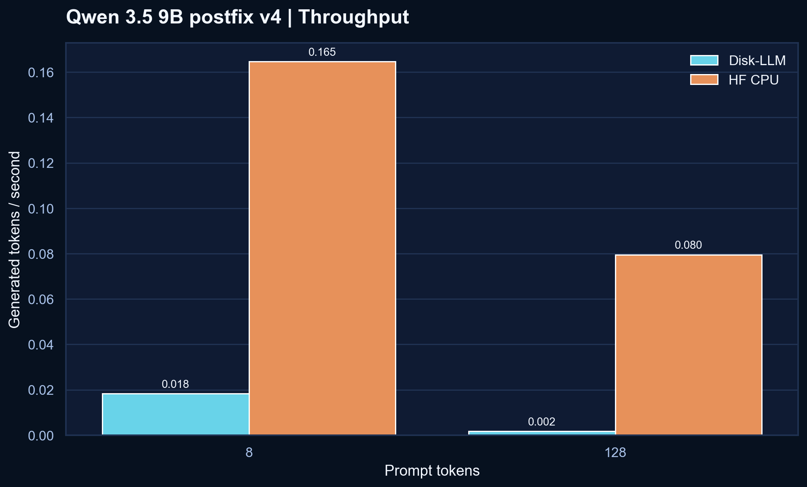
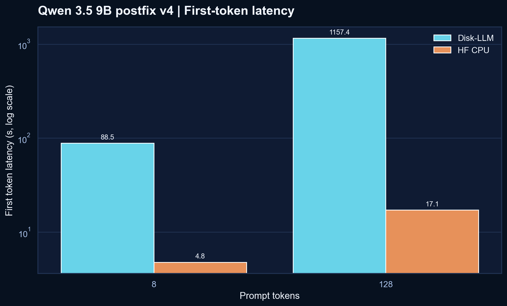
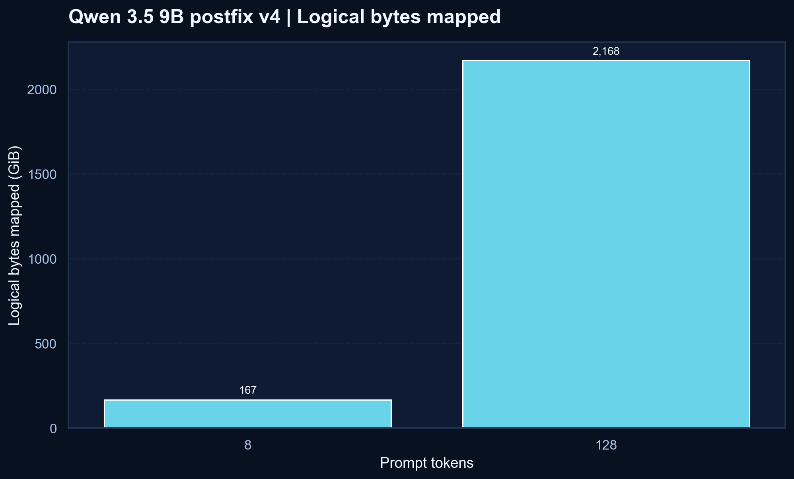
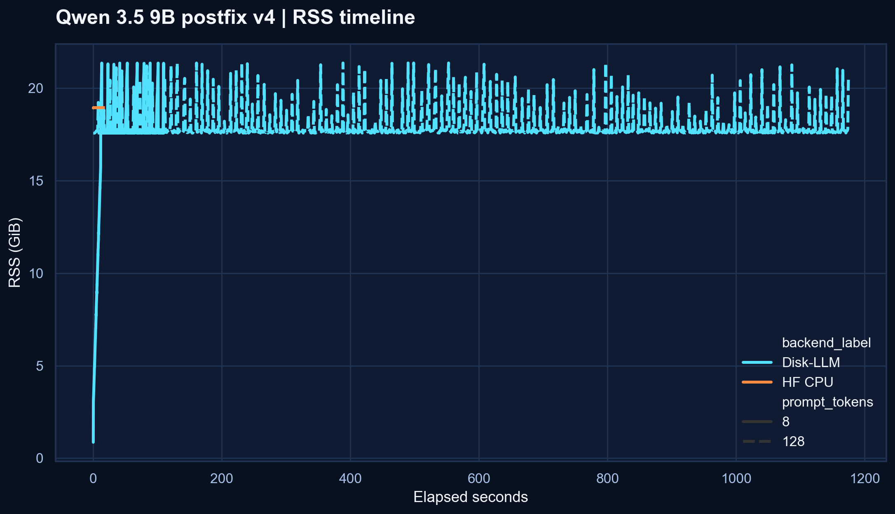

<p align="center">
  
</p>

# Disk-LLM

[](https://github.com/kilickursat/disk-llm/actions/workflows/modal-benchmark.yml)
[](LICENSE)
[](#quick-start)
[](#current-validated-qwen-baseline)

Disk-LLM is an inspectable disk-backed LLM research kit built around one idea: if model weights are going to stream from disk, that path should stay explicit, measurable, and understandable.

Instead of treating checkpoint files as the runtime layout, Disk-LLM repacks text weights into layer-oriented memmap shards, runs a native NumPy CPU path, and exports telemetry about what the runtime actually touched. The project website is published at [kilickursat.github.io/disk-llm](https://kilickursat.github.io/disk-llm/).

## Current Validated Qwen Baseline

The latest fully validated Modal result bundle is tracked in [`modal-results-postfix/qwen35-9b-postfix-v4`](modal-results-postfix/qwen35-9b-postfix-v4).

This is the current honest baseline for `Qwen/Qwen3.5-9B` on the repo's native NumPy memmap path after the HF CPU image cleanup and small runtime caching tweaks:

- run label: `qwen35-9b-postfix-v4`
- requested revision: `main`
- resolved SHA: `c202236235762e1c871ad0ccb60c8ee5ba337b9a`
- packed tensors: `427`
- packed shards: `34`
- packed footprint: `16.68 GiB`
- executed layers: `32`
- benchmark shape: prompt lengths `8` and `128`, generate `2`, `runs = 1`, `warmup_runs = 0`

This is still not a win report. It is the current validated full-model research snapshot, and `v4` remains slower than the HF CPU reference on this Modal setup.

<table>
  <tr>
    <td></td>
    <td></td>
  </tr>
  <tr>
    <td></td>
    <td></td>
  </tr>
</table>

## Qwen v4 Comparison

| Prompt tokens | Backend | Tokens/s | First token (s) | Peak RSS (MB) | Logical mapped (MB) |
| --- | --- | ---: | ---: | ---: | ---: |
| 8 | Disk-LLM | 0.0183 | 88.501 | 21873.83 | 170780.32 |
| 8 | HF CPU | 0.1646 | 4.773 | 19403.96 | - |
| 128 | Disk-LLM | 0.00170 | 1157.395 | 21885.98 | 2220144.13 |
| 128 | HF CPU | 0.0795 | 17.142 | 19407.14 | - |

What changed from `v3`:

- Disk-LLM prompt `8` improved from `0.0147` to `0.0183` tok/s, first-token latency fell by `25.7s`, and peak RSS dropped by about `2.59 GB`.
- Disk-LLM prompt `128` improved from `0.00130` to `0.00170` tok/s, first-token latency fell by `363.5s`, and peak RSS dropped by about `2.59 GB`.
- HF CPU also got leaner on this run, so the comparison remains honest: Disk-LLM improved, but HF CPU is still materially faster.

## Legacy Note

The earlier checked-in bundle at [`modal-results-postfix/qwen35-9b-modal-cpu-postfix`](modal-results-postfix/qwen35-9b-modal-cpu-postfix) is now best read as a legacy pre-guard artifact, not the current baseline.

Its `benchmark_runs.csv` reported `layer_count = 0` and `tensors_touched = 3` for Disk-LLM, so it should not be used as the headline comparison for the current branch.

The immediately previous validated bundle at [`modal-results-postfix/qwen35-9b-postfix-v3`](modal-results-postfix/qwen35-9b-postfix-v3) remains useful as the before-state for `v4`, but it is no longer the current headline snapshot.

## Why Disk-LLM Exists

Disk-LLM is most compelling when it is judged as a research system rather than a generic inference stack.

- **Layout-first conversion:** checkpoints are repacked into layer-oriented shard files so the runtime layout is deliberate and inspectable.
- **Memmap-native CPU path:** the project keeps disk-backed behavior visible instead of hiding it inside a larger serving engine.
- **Storage-facing telemetry:** logical bytes mapped, tensors touched, first-token latency, and per-layer timings make the benchmark story auditable.
- **Benchmark honesty guards:** the repo now rejects zero-layer benchmark exports instead of letting misleading rows become polished figures.
- **Remote reproducibility:** the Modal workflow can inspect, pack, benchmark, and archive large-model artifacts without forcing a full local download.

## Quick Start

### 1. Install

```bash
pip install -e .
```

Optional extras:

```bash
pip install -e .[hf,demo,test,bench]
```

For Hugging Face parity or CPU-baseline benchmarks, make sure a CPU PyTorch build is available in the environment.

### 2. Inspect a source snapshot

```bash
disk-llm inspect --source-dir /path/to/Qwen3.5-9B
```

### 3. Convert it into Disk-LLM layout

```bash
disk-llm convert /path/to/Qwen3.5-9B ./packed-qwen35
```

### 4. Inspect the packed manifest

```bash
disk-llm inspect --manifest ./packed-qwen35/manifest.json
```

### 5. Generate from the packed model

```bash
disk-llm generate ./packed-qwen35/manifest.json --prompt "Explain disk-backed inference in one paragraph."
```

### 6. Run repeated benchmark cases

```bash
python scripts/benchmark.py ./packed-qwen35/manifest.json \
  --prompt "Explain disk-backed inference in one paragraph." \
  --tokenizer /path/to/Qwen3.5-9B \
  --backends disk_llm,hf_cpu \
  --hf-model /path/to/Qwen3.5-9B \
  --prompt-lengths 8,64,256,512 \
  --max-new-tokens 16 \
  --runs 3 \
  --output-dir ./benchmark-results/qwen35-cpu
```

Outputs:

- `benchmark_runs.csv`
- `benchmark_summary.csv`
- `memory_timeline.csv`
- `benchmark_metadata.json`

### 7. Generate plots

```bash
python scripts/plot_results.py ./benchmark-results/qwen35-cpu
```

### 8. Keep the model off your local machine

If you want to run the full workflow remotely on Modal, use the runbook in [`docs/modal_remote_run.md`](docs/modal_remote_run.md).

Helper wrappers:

- `scripts/run_modal_qwen35_9b.sh`
- `scripts/run_modal_qwen35_9b.ps1`

## What Gets Packed

The default v1 converter targets the text-only path:

- `model.embed_tokens.*`
- `model.layers.<n>.*`
- `model.language_model.layers.<n>.*`
- `model.norm.*`
- `model.language_model.norm.*`
- `lm_head.*`

Known multimodal tensors such as `visual.*` are skipped and recorded in the manifest.

Weights are copied into layer-oriented shards:

- `embeddings/embeddings.bin`
- `layers/layer_000.bin`
- `layers/layer_001.bin`
- `...`
- `final/final.bin`

Each tensor receives a manifest entry with:

- shard path
- byte offset
- byte length
- source file
- dtype
- shape
- tensor checksum

## Telemetry

Every runtime call can emit:

- logical bytes mapped
- tensors touched
- per-layer wall time
- first-token latency
- generated token count
- tokens per second

The benchmark scripts extend that with repeated-run CSVs, RSS sampling via `psutil`, Markdown summaries, and plot generation.

## Roadmap

- keep the README and GitHub Pages synced to real validated result bundles, even when the current numbers are unfavorable
- optimize the HF CPU image path so the Modal baseline stops pulling an oversized CPU-unfriendly Torch stack
- apply only small Disk-LLM runtime tweaks that preserve the project's native NumPy memmap identity
- run the matching prefetch experiment against the validated postfix `v4` baseline
- rerun the matching prefetch experiment after the postfix baseline is improved
- expand to additional model families such as Gemma and GLM once the Qwen path is stable
- use those later results for the stronger publication pass

## Development

Run the stdlib test suite:

```bash
python -m unittest discover -v
```

The repo is designed to stay importable even when optional dependencies are missing, which makes it easier to inspect the converter, manifest flow, and CLI without first downloading a full inference stack.

## Contributing

Please read [CONTRIBUTING.md](CONTRIBUTING.md) before opening a pull request.

High-value contributions include:

- new tensor-name adapters
- runtime correctness tests against reference implementations
- benchmark datasets and published result bundles
- better inspection for hybrid block layouts
- tokenizer and chat-template integration improvements
